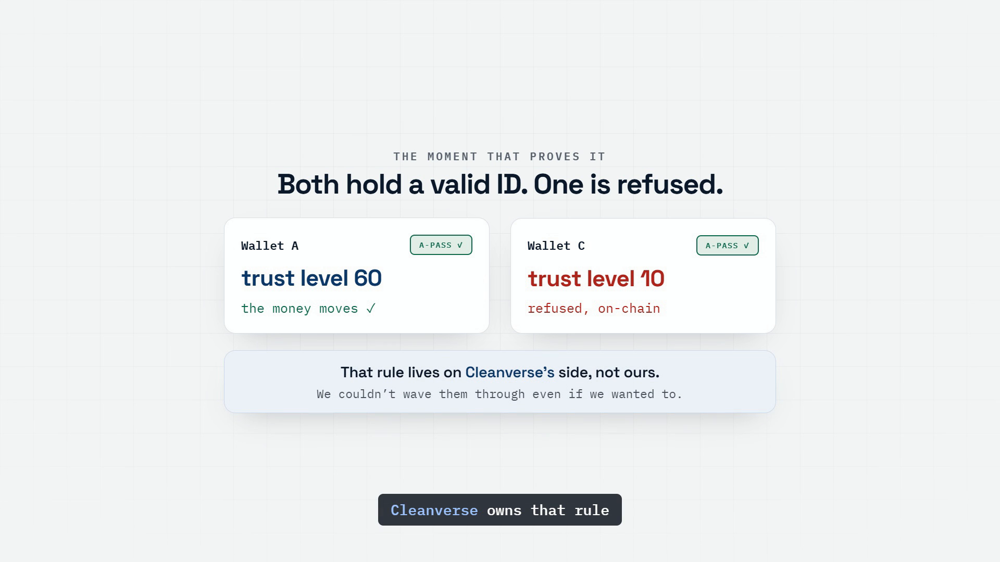

# Continuum

**Compliance that travels with the token.** Permissioned liquid staking on
Monad testnet, built for the Cleanverse Build: Trusted Assets Hackathon
(DeFi track, deadline 2026-08-09).

Stake as a Cleanverse-verified user (A-Pass / CVI) and receive **stMON** — a
policy-gated liquid staking receipt whose every transfer re-checks the
counterparty's credential at the token layer. When a credential is revoked,
the position freezes for circulation but is never trapped: a controlled exit
delivers the underlying value to a verified receiver after compliance review.
**Compliance without confiscation.**

## Demo

[](https://github.com/0xWeb3Mayor/continuum/blob/main/demo-video/continuum-demo.mp4)

**[▶ Watch the demo](https://github.com/0xWeb3Mayor/continuum/blob/main/demo-video/continuum-demo.mp4)** — 73 seconds, narrated. The
problem, the stake flow, the tier refusal that Cleanverse enforces, and the
controlled exit that returns 1.1 MON to a revoked holder.

- **One-page summary:** [`docs/Continuum-One-Pager.pdf`](docs/Continuum-One-Pager.pdf)
- **Live site:** [usecontinuum.cc](https://usecontinuum.cc)

## Status — live on Monad testnet (chain 10143)

| Contract | Address |
| --- | --- |
| ComplianceRouter | `0x4c0316B790a6a7E194abd06E69e42fdf8c67c5F6` |
| StMON | `0x940d14C41d6F8E47549e51402219898398C8b31a` |
| StakingVault | `0x75dC8959c906679f477F9c8720A0656589B4A37a` |
| RedemptionQueue | `0x1819cA49E22e143025eCb5689873D2155E7647Db` |
| MockAPass (local registry) | `0x5cFcF818a46d483C400E3Ebd7B82e97e5B612897` |

49 Foundry tests passing. Full deployment and demo-wallet detail in
[`docs/deployment.md`](docs/deployment.md).

## Why this lane

The DeFi track brief names three themes: gated lending pools (~10 competing
teams), identity-based lending (~4 teams), and **permissioned staking — zero
registered teams**. Continuum occupies the named, empty lane.

## How Cleanverse is wired in

Remove Cleanverse and there is no product. The integration is enforcement, not
display:

- **Registered compliance pool.** `ComplianceRouter` is registered with the
  Cleanverse CVI validator at `0xaC7e5179C2C7f03f209136886c172eb34F161792`
  (registration tx `0x8115fe99…`). Registration is signed by the contract
  owner via EIP-191.
- **A tier rule enforced by Cleanverse, not by us.** The pool carries
  `min_sub_tier 30` (tx `0xae15603d…`). A wallet holding a valid, active
  A-Pass at sub-tier 10 is refused — the threshold lives on Cleanverse's
  contract, so we cannot quietly wave anyone through.
- **On-chain, on every state change.** Gated paths call
  `complianceVerify(pool, user)` on the validator. `ComplianceRouter` runs in
  `RequireBoth`, so a wallet must satisfy both the local registry and
  Cleanverse.
- **Fail-closed.** `complianceVerify` reverts for an unregistered pool, so the
  call is wrapped: if the validator cannot answer, strict modes refuse rather
  than permit.
- **Live credential reads.** The Verify panel shows the real A-Pass record
  (tier, sub-tier, group, countries, expiry) read through `query_apass`,
  proxied server-side so the institutional `api-id` never reaches the browser.

## Repository layout

- `web/` — Next.js + wagmi frontend (landing page, dApp, legal pages).
- `contracts/` — Foundry contracts, tests, and deploy script.
- `docs/deployment.md` — live addresses, rule state, demo wallets.
- `docs/demo-script.md` — 3-minute recording script, beat by beat.
- `docs/specs/` — approved design spec and implementation plan.

## Running it

```bash
cd contracts && forge test
cd ../web && cp .env.example .env.local   # fill in addresses + Cleanverse keys
npm install && npm run dev
```

## Production readiness

Continuum works end to end on Monad testnet. It is **not** production software,
and the reasons are worth stating plainly.

**1. We attest to identities we have not verified.** `generate_apass` is an
institutional attestation endpoint: `kycSource` / `kycId` are where a licensed
member names the KYC provider and reference for a check it already performed.
Cleanverse relaxed that requirement for the hackathon, which is the only reason
our one-click testnet access can work. In production, issuing an A-Pass for an
anonymous wallet would be a false attestation — precisely what the credential
exists to prevent. The real path is Cleanverse KYC registration, or becoming a
Gateway Member and supplying genuine KYC references.

**2. The operator key is hot, and the rate limit is not durable.**
`OPERATOR_PRIVATE_KEY` owns the local registry and signs from the web server.
The demo-access rate limit is in-memory, so it resets on restart and does not
span instances. Production needs a separate signer service (multisig or HSM)
and a shared store. Demo access is off unless `DEMO_ONBOARDING` is set.

**3. The local registry is scaffolding.** `MockAPass` exists so the demo can
show revocation on command, and because it gives us a known-but-revoked state
that the validator's pass/fail answer cannot express — which is what makes the
controlled exit possible. In production Cleanverse should be the sole
authority: switch `ComplianceRouter` to `ValidatorOnly` and retire the mock.

## Claims discipline

- stMON is a Cleanverse **policy-gated liquid staking receipt**, not a
  CVA/A-Token. CVA issuance is an approval-gated flow (`PENDING → APPROVED →
  ISSUED`) we did not complete; the CCP guide's Method B contract template is
  the documented upgrade path.
- Staking rewards on testnet are **simulated** — a deterministic drip that
  raises redemption value — and every surface says so.
- Audit exports are **audit attribution**, not Travel Rule reporting, unless
  and until a reporting path is confirmed.
- Testnet tokens have no monetary value.
